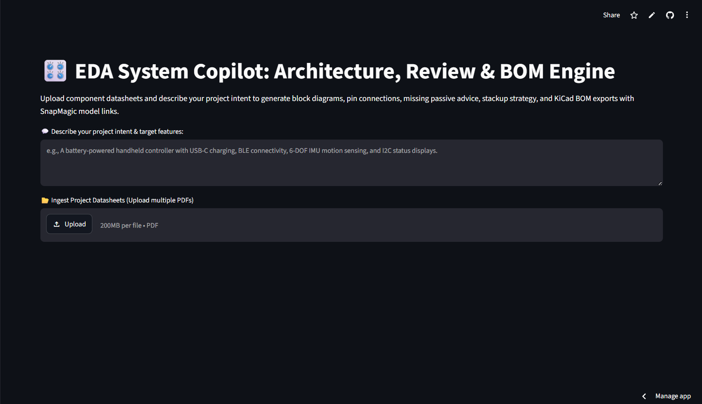
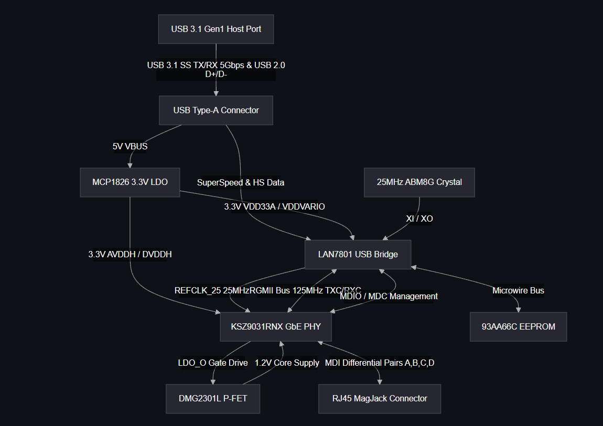
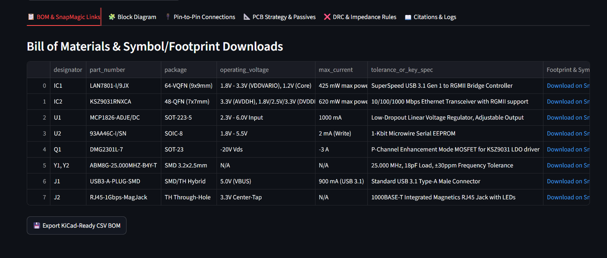
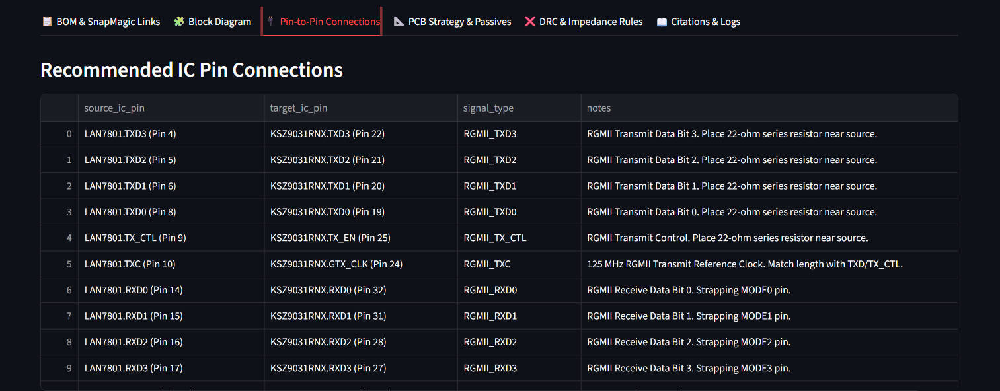

## PCB-DESIGN-CopilotV2

PCB Copilot is an AI-powered hardware design assistant built using Streamlit and Google's Gemini API. It helps hardware engineers review system architectures before schematic design by analyzing multiple component datasheets together.

Instead of manually searching through hundreds of datasheet pages, users can upload PDF datasheets along with a project description. PCB Copilot then generates a consolidated hardware overview, identifies missing support components, recommends PCB design practices, and provides datasheet-backed design recommendations.
Link: https://isb5apurhj7humxr6uwrtr.streamlit.app/

---

## Project Overview

PCB Copilot combines multiple component datasheets into a single hardware design workflow. It assists with component compatibility checks, architecture planning, BOM generation, PCB layout recommendations, and documentation.

The goal of this project is to reduce the amount of manual datasheet review required during the early stages of hardware design.

---

## Preview

### Home Page



### Generated Block Diagram



### Generated BOM



### PIN Connections



---

## How It Works

1. Upload one or more component datasheets (PDF).
2. Enter a description of the hardware project.
3. PCB Copilot analyzes all uploaded datasheets together.
4. Gemini generates design recommendations and engineering documentation.
5. Results are displayed through the Streamlit interface.

---

## Features

- Analyze multiple hardware datasheets simultaneously
- Generate system architecture block diagrams
- Create consolidated Bill of Materials (BOM)
- Generate pin-to-pin connection tables
- Detect missing support components
- Recommend PCB layer stackup
- Suggest PCB layout practices
- Flag high-speed interfaces requiring impedance control
- Cross-check component compatibility
- Provide datasheet page references for generated information

---

## Technologies Used

- Python
- Streamlit
- Google Gemini API
- Pandas
- Mermaid.js

---

## Example Output

PCB Copilot can generate:

- System block diagrams
- Component BOM
- Interface connection tables
- PCB layout recommendations
- Stack-up suggestions
- Required support components
- Controlled impedance warnings
- Design review reports

---

## Repository Structure

```
PCB-Copilot
│
├── app.py
├── requirements.txt
├── README.md
└── Images/
```

---

## Future Improvements

- KiCad project generation
- Interactive schematic suggestions
- Automatic ERC/DRC report generation
- BOM cost estimation
- Multi-board system support
- Export reports as PDF

---

## Author

**Ayush Shukla**

B.Tech Electronics & Telecommunication Engineering
